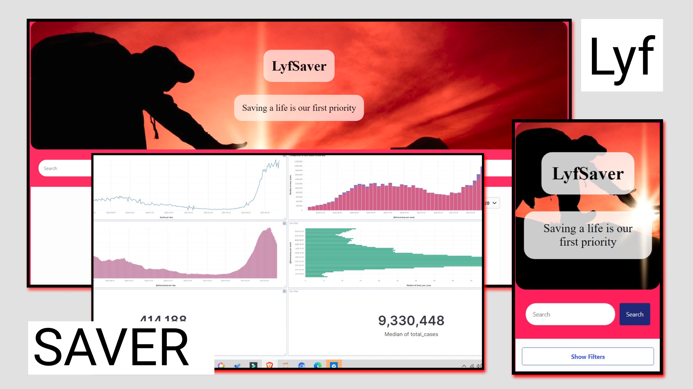

# LyfSaver
This project will provide all covid resources such as oxygen cylinders, medicine, food, and others. It uses the elastic search in the backend to optimize the results. 

## Web Preview
<p>
    
</p>

## Inspiration
All of us have lost someone in this pandemic and a third wave is also approaching. This site provides all types of verified resources so that noone loses their life.

## What it does
LyfSavr fetches data of resources like Oxygen cylinders, availability of beds in Hospitals, important medicines like Fabiflu, Ambulance and provides a search engine to search for any type of resources and also sort them according to your state, last update status, availability of the resource and verification of the resource.

## How we built it
We used requests python lib to fetch the latest data from cowin portal and post-ed that data to elasticseach using the elastic_enterprise_search python package. 
We created the frontend to query our database of resources with react reference UI.

## Challenges we ran into
How to customize the site for better UI/UX.
Authentication of user to post data and query the database from the frontend.

## Accomplishments that we're proud of
We got  a hang of the elastic stack in pretty less time and made a working product in the given time.

## What we learned
Elasticsearch, Distributed systems, React render-props

## What's next for LyfSaver
We want to upgrade the UI/UX of the web-app and make it a PWA.


## Deploy and Share

This app can be easily published to any server as static assets and served. We recommend [Netlify](https://www.netlify.com/), but you have other [options](https://facebook.github.io/create-react-app/docs/deployment) as well.

To deploy:

```
npm run build
npm install netlify-cli -g
netlify deploy # enter ./build as the deploy path
```

You'll then simply follow the command prompt to log into Netlify and deploy your site. This can be completed in just a few minutes.


## License 📗

[Apache-2.0](https://github.com/elastic/app-search-reference-ui-react/blob/master/LICENSE.md) © [Elastic](https://github.com/elastic)

Thank you to all the [contributors](https://github.com/elastic/app-search-reference-ui-react/graphs/contributors)!
